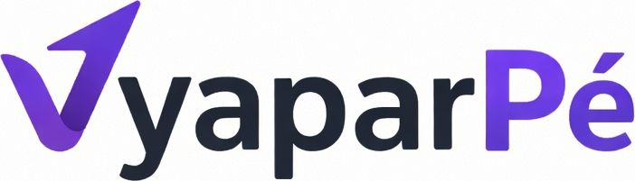

# 🚀 VyaparPe — Premium E-commerce Storefront

**VyaparPe** is a state-of-the-art, high-performance e-commerce storefront built with **Next.js 15**, **TypeScript**, and **CSS Modules**. It features a highly dynamic, context-aware homepage navigation system, advanced faceted search, and a premium "glassmorphism" design aesthetic.



## ✨ Key Features

### 🌈 Context-Aware Homepage
*   **Dynamic Navigation**: Categories switch homepage context via `/?category=...` without losing performance.
*   **Smart Hero Banners**: Hero sliders automatically adjust their offers and gradients based on the active category.
*   **Contextual Sections**: Trending, Flash Sales, and Promo sections filter dynamically to show only relevant products.

### 🔍 Advanced Search & Discovery
*   **Cascading Faceted Search**: Intelligent filter engine that eliminates "zero results" traps by providing valid filter combinations.
*   **Multi-Select Brand Filters**: True OR-logic brand selection via URL-encoded filtering.
*   **Smart Autocomplete**: Global Navbar search with instant results and category suggestions.

### 📦 Robust Product Engine
*   **Hybrid Product Support**: Seamless handling of Physical Goods, Digital Downloads, and Services (with booking slots).
*   **Deep Variant Management**: Supports image-swapping, price modifiers, custom text/hex inputs, and multi-select variant configurations.
*   **Trust Indicators**: Real-time stock status ("Only X left!"), verified expert badges, and warranty cards.

### 🛒 High-Performance UX
*   **Glassmorphism UI**: A premium visual style with subtle blurs, elegant gradients, and micro-animations.
*   **Cart & Wishlist**: Optimized state-managed drawers for a friction-less checkout experience.
*   **Theme Engine**: Built-in support for Dark, Light, and System themes.

## 🛠️ Tech Stack

- **Framework**: [Next.js 15](https://nextjs.org/) (App Router)
- **Language**: [TypeScript](https://www.typescriptlang.org/)
- **Styling**: Vanilla CSS Modules (Glassmorphism architecture)
- **Optimization**: Turbopack & Image Optimization
- **Icons**: Lucide-inspired Emoji icons for universal compatibility
- **Components**: Functional React Components with `useMemo` & `useCallback` optimization

## 📂 Project Structure

```text
storefront/
├── public/          # Static assets & logos
├── src/
│   ├── app/         # Next.js App Router (pages & layouts)
│   ├── components/  # Atomic & Molecular UI components
│   ├── context/     # React Context for Cart & Global state
│   ├── data/        # Mock product engine & helper functions
│   └── styles/      # Global CSS & Design Tokens
└── scripts/         # Audit & Data Enrichment utilities
```

## 🚀 Getting Started

1.  **Clone & Install**:
    ```bash
    git clone https://github.com/faisalkhan119/vyaparpe.git
    cd vyaparpe/storefront
    npm install
    ```

2.  **Run Development Server**:
    ```bash
    npm run dev
    ```

3.  **Explore**:
    Open [http://localhost:3000](http://localhost:3000) to see the magic.

---

## 📄 License

Built with ❤️ for the **VyaparPe** Ecosystem.
